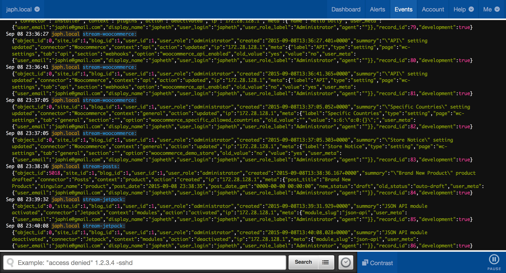

<!-- DO NOT EDIT THIS FILE; it is auto-generated from readme.txt -->
# Stream to Papertrail

Send your Stream records to Papertrail for safe-keeping.

**Contributors:** [japh](https://profiles.wordpress.org/japh)  
**Tags:** [papertrail](https://wordpress.org/plugins/tags/papertrail), [stream](https://wordpress.org/plugins/tags/stream), [logging](https://wordpress.org/plugins/tags/logging), [hosted](https://wordpress.org/plugins/tags/hosted), [actions](https://wordpress.org/plugins/tags/actions), [activity](https://wordpress.org/plugins/tags/activity), [activity log](https://wordpress.org/plugins/tags/activity log), [activity logs](https://wordpress.org/plugins/tags/activity logs), [admin actions](https://wordpress.org/plugins/tags/admin actions), [analytics](https://wordpress.org/plugins/tags/analytics), [audit](https://wordpress.org/plugins/tags/audit), [audit log](https://wordpress.org/plugins/tags/audit log), [audit logs](https://wordpress.org/plugins/tags/audit logs), [change](https://wordpress.org/plugins/tags/change), [changes](https://wordpress.org/plugins/tags/changes), [log](https://wordpress.org/plugins/tags/log), [logs](https://wordpress.org/plugins/tags/logs), [stream](https://wordpress.org/plugins/tags/stream), [tracking](https://wordpress.org/plugins/tags/tracking), [troubleshooting](https://wordpress.org/plugins/tags/troubleshooting), [wp stream](https://wordpress.org/plugins/tags/wp stream)  
**Requires at least:** 4.3  
**Tested up to:** 4.3  
**Stable tag:** 0.0.5  
**License:** [GPLv2 or later](https://www.gnu.org/licenses/gpl-2.0.html)  

## Description ##

[Stream](https://wordpress.org/plugins/stream/) records activity on your WordPress site in your WordPress database. This plugin allows you to also send those records to [Papertrail](https://papertrailapp.com/) for safe-keeping (and from there, you can also archive to Amazon S3).

_Development of Stream to Papertrail takes place on GitHub. If you have problems or suggestions, please [create an issue](https://github.com/Japh/stream-to-papertrail/issues) there._

## Installation ##

1. Search for Stream to Papertrail in your WordPress dashboard.
2. Install the plugin, and activate it.
3. Set the Destination for Papertrail on your Stream settings screen.

## Screenshots ##

### Papertrail's display of colourised logs

## Changelog ##

### 0.0.5 - September 8, 2015 ###
* Made admin notices and explanation of Destination option clearer
* Removed 'program' and 'component' options in favour of using existing information

Props [@Japh](https://github.com/japh), [@sirjonathan](https://github.com/sirjonathan), [@Troy](https://github.com/troy)

### 0.0.4 - September 7, 2015 ###
* Added option to enable/disable colourisation

Props [@Japh](https://github.com/japh)

### 0.0.3 - September 7, 2015 ###
* Added ANSI escape codes for colourisation

Props [@Japh](https://github.com/japh)

### 0.0.2 - September 5, 2015 ###
* Switched from using constants to options on the Stream settings screen
* Added check for Stream

Props [@Japh](https://github.com/japh)

### 0.0.1 - September 3, 2015 ###
* Initial release

Props [@Japh](https://github.com/japh), [@Troy](https://github.com/troy)

